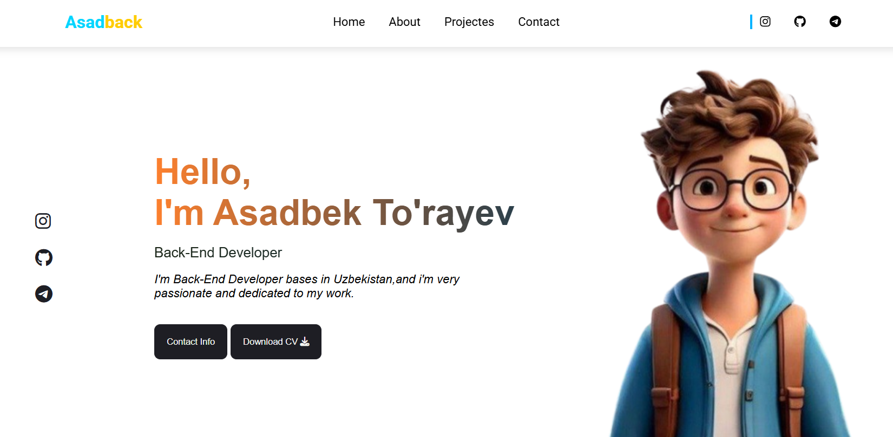

# Asadback Landing Page

A sleek and modern landing page project developed as part of my web development portfolio. This project showcases clean UI/UX design and responsive layout principles.

## 🖼️ Preview


## 🚀 Features
* **Modern Design**: Aesthetic UI with smooth gradients and professional typography.
* **Fully Responsive**: Works flawlessly on desktops, tablets, and mobile devices.
* **Interactive Elements**: Includes hover effects and dynamic components using JavaScript.
* **Clean Code**: Organized CSS structure and semantic HTML5.

## 🛠️ Technologies Used
* **HTML5**: For semantic web markup.
* **CSS3**: Custom styling including flexbox/grid and text gradients.
* **JavaScript**: For interactive logic.

## 📂 Project Structure
```text
Asadback-landing-page/
├── .gitignore        # Files to ignore in Git
├── index.html        # Main entry point
├── main.js           # JavaScript logic
├── style.css         # Custom styling
├── asad.png          # Asset images
└── page.png          # Project screenshot